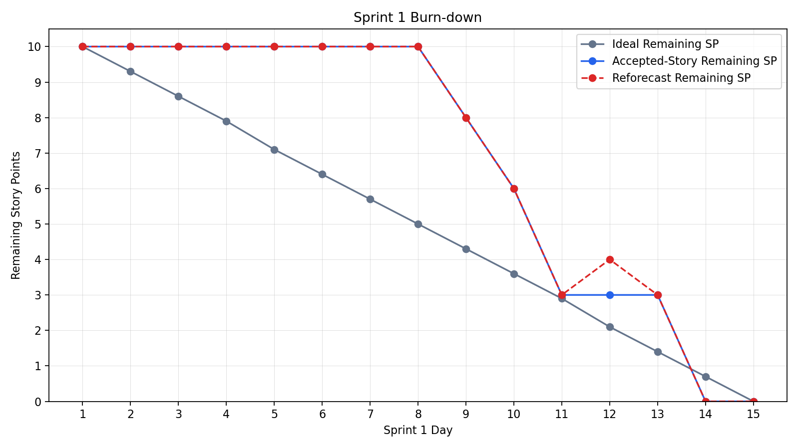

# Burn Down Chart - Assignment 2

- Document your Burn Down Chart to track the progress of Sprint 1 for Assignment 2.
- Refer to Burn_Down_Chart_Example_and_Guide.md under the Guides folder for guidance on how to document this section. An example is shown.
- You can reuse formatting and sections from the guidance for documenting this section

------

## Sprint 1 Burn Down Chart

**Sprint Duration:** 13 April 2026 12:00 - 27 April 2026 00:00 AEST
**Tracking Basis:** Daily calendar checkpoints. Day 15 is the submission deadline checkpoint, not a normal working day.
**Total Story Points Committed:** 10 SP
**Stories:** US-01 (3 SP), US-02 (2 SP), US-03 (2 SP), US-04 (3 SP)

## Reconstruction and Update Rule

The ideal burn-down line was fixed during Sprint Planning. The team made progress each day, but not every daily change was recorded at the time. This chart therefore uses a close-out reconciliation method, daily points were reconstructed from stand-up/checkpoint notes, Sprint Backlog changes, defect records, WordPress evidence, and Definition of Done checks.

The Sprint 1 chart is maintained using the following tracking rules:

- Story-point burn-down records the best reconstructed story-completion checkpoint from the Sprint Backlog, stand-up/checkpoint notes, and final close-out evidence.
- The 2026-04-26 QA table records final regression and evidence reconciliation, not necessarily the first date when each story became implementation-ready or had an initial validation check.
- If final QA found rework, the defect was recorded and resolved before close-out rather than moving all earlier progress to the final day.
- Requirement clarifications that reduced required validation scope were recorded as a downward reforecast on the actual/reforecast line, without changing the original committed story points.
- When US-04 exposed additional rework on Day 12, the actual/reforecast line moved upward from 3 SP to 4 SP.
- The original committed story points did not change; the temporary downward and upward movements represent reforecast effort caused by requirement clarification and discovered implementation work.
- If future sprint work introduces new scope or failed validation, the actual line should be updated upward rather than retrospectively smoothed.

## Risk Response Use of the Actual / Reforecast Line

The **Actual / Reforecast Remaining** line is also used as a Sprint 1 risk-response and monitoring strategy. It does not replace the story burn-down line and does not change the original Sprint 1 commitment. Instead, it gives the Scrum Team a visible way to record when a risk or clarification changes the amount of remaining work inside the committed stories.

This was useful in two Sprint 1 cases:

- `R006` materialised when the `US-02` library requirement was clarified. The line moved downward on Day 5 because the required validation scope was reduced.
- `R004` materialised when the direction workflow exposed ORS/API and WordPress permission constraints. The line moved upward on Day 12 because additional rework was needed before `US-04` could be accepted.

Using this line as a risk-response signal helps the team avoid two weak Scrum behaviours: silently rewriting the sprint history, or smoothing the burn-down after the fact so that risks and rework disappear from the artefact.

## Requirement Deletions and Burn-down Treatment

The current Sprint 1 requirement text removes two earlier library-related assumptions: university library locations are no longer required for `US-02`, and university/public library colour distinction is no longer required. This is not shown by deleting `US-02` from the sprint, because the story still requires City of Melbourne library marker configuration, popup details, QA, and evidence.

The chart therefore records the clarification as a small downward reforecast on Day 5:

- The **Story Remaining Line** stays unchanged at 10 SP on Day 5 because no whole user story was removed or accepted on that day.
- The **Actual / Reforecast Remaining Line** drops from 10 SP to 9.5 SP on Day 5 to show reduced validation/configuration effort after the deleted university-library and library-colour requirements.
- Later, the same actual/reforecast line rises from 3 SP to 4 SP on Day 12 when `US-04` routing and WordPress permission work created additional rework.

This approach follows the burn-down guide: the ideal line remains fixed, while the actual line can move down or up when real sprint conditions change.

## Burn Down Data Table

| Day | Date | Ideal Remaining (SP) | Story Remaining (SP) | Actual / Reforecast Remaining (SP) | Daily Update / Change Note |
| --- | ---- | -------------------- | ----------------------------- | ---------------------------------- | -------------------------- |
| 1 | Apr 13 (Mon) | 10.0 | 10 | 10 | Sprint start; task assignments confirmed and Sprint 1 WordPress/map work began. |
| 2 | Apr 14 (Tue) | 9.3 | 10 | 10 | WordPress access, plugin options, and map setup assumptions reviewed; progress made but no story reached DoD. |
| 3 | Apr 15 (Wed) | 8.6 | 10 | 10 | Location list, marker fields, and dataset scope checked; no story reached DoD. |
| 4 | Apr 16 (Thu) | 7.9 | 10 | 10 | Stand-up/checkpoint: WP Go Maps + Leaflet confirmed as the map solution; data work continued. |
| 5 | Apr 17 (Fri) | 7.1 | 10 | 9.5 | Requirement clarification reduced US-02 validation scope: university-library coverage and library colour distinction were no longer required. No whole story reached a completion checkpoint, so story remaining stayed at 10 SP. |
| 6 | Apr 18 (Sat) | 6.4 | 10 | 9.5 | Marker configuration progressed under the clarified US-02 scope; US-04 approach still under review. |
| 7 | Apr 19 (Sun) | 5.7 | 10 | 9.5 | Direction feasibility risk escalated for focused follow-up; no story burned yet. Reduced US-02 validation scope remained reflected in the reforecast line. |
| 8 | Apr 20 (Mon) | 5.0 | 10 | 9.5 | Configuration and validation work continued; story-level DoD evidence still incomplete. |
| 9 | Apr 21 (Tue) | 4.3 | 8 | 8 | **US-03 completed checkpoint:** marker popup details were configured and checked against the story expectation. Final screenshot/evidence reconciliation was completed during close-out. |
| 10 | Apr 22 (Wed) | 3.6 | 6 | 6 | **US-02 completed checkpoint:** the required City of Melbourne area library marker was configured under the clarified scope. Dataset-source evidence was reconciled before submission. |
| 11 | Apr 23 (Thu) | 2.9 | 3 | 3 | **US-01 completed checkpoint:** building markers were configured and checked; US-04 ORS/API blocker was raised. A colour-distinction defect was later found in final QA and fixed before close-out. |
| 12 | Apr 24 (Fri) | 2.1 | 3 | 4 | US-04 remained open. Reforecast increased by 1 SP because ORS/API configuration, Code Snippets 403, and route visibility fixes added rework before acceptance. |
| 13 | Apr 25 (Sat) | 1.4 | 3 | 3 | API key issue was resolved and route display settings improved; rework reduced, but US-04 still required final route validation. |
| 14 | Apr 26 (Sun) | 0.7 | 0 | 0 | **US-04 completed and final QA reconciliation finished:** direction workflow was validated end-to-end, US-01 colour distinction was fixed and retested, and Sprint 1 evidence was reconciled. |
| 15 | Apr 27 (Mon) | 0.0 | 0 | 0 | Submission deadline checkpoint at 00:00 AEST; no additional story points remained. |

## Burn Down Chart Visual

The chart above plots three signals:

- The **Ideal Burn Down Line** runs straight from 10 SP on Day 1 to 0 SP on Day 15.
- The **Story Remaining Line** shows the reconstructed story-level burn-down after each story reached its completion checkpoint.
- The **Actual / Reforecast Remaining Line** shows daily remaining effort after accounting for requirement clarification, discovered rework, and implementation uncertainty.

## Chart Interpretation

**X-Axis:** Sprint checkpoints (Day 1 = 13 April 2026 to Day 15 = 27 April 2026 deadline checkpoint)

**Y-Axis:** Remaining story points / reforecast effort (0-10)

**Ideal Burn Down Line:** A straight line from 10 SP on Day 1 to 0 SP on Day 15, representing a linear completion rate of approximately 0.71 SP per calendar checkpoint. This line was fixed at Sprint Planning and was not adjusted at any point during the sprint.

**Story Remaining Line:** This line remained flat at 10 SP from Day 1 through Day 8 because task progress had not yet converted into story-level completion checkpoints. It then dropped when stories reached their reconstructed completion checkpoints:

- Day 9 (Apr 21): US-03 marker popup detail work completed - 8 SP remaining.
- Day 10 (Apr 22): US-02 required City of Melbourne area library marker work completed under the clarified scope - 6 SP remaining.
- Day 11 (Apr 23): US-01 building marker work completed at the story checkpoint - 3 SP remaining.
- Days 11-13: US-04 remained open because routing/API and environment-permission constraints were not fully resolved.
- Day 14 (Apr 26): US-04 completed and final QA/evidence reconciliation closed the sprint - 0 SP remaining.

**Actual / Reforecast Remaining Line:** This line is the more realistic process signal. It separates story-completion checkpoints from changes in remaining effort. It dips from 10 SP to 9.5 SP on Day 5 when the `US-02` library requirement is clarified and validation work is reduced. It then follows delivery progress until Day 12, when `US-04` creates additional implementation work. The increase from 3 SP to 4 SP records a genuine change in remaining effort caused by ORS/API configuration work, Code Snippets 403, and route-display validation. The line then drops back to 3 SP on Day 13 after the API and route display work improved, and reaches 0 SP on Day 14 after final validation.

The Day 5 downward movement records a requirement clarification: the library story no longer needed university-library coverage or library colour distinction. The Day 12 upward movement records implementation rework for `US-04`. No committed user story was removed from Sprint 1 and no new user story was added; the actual/reforecast line shows changing remaining effort inside the committed stories.

**Key Observation:** The chart shows both gradual delivery progress and realistic variation. The Day 5 downward reforecast records a requirement clarification, the Day 12 upward reforecast records routing rework, and the Day 14 close-out records final validation and evidence reconciliation. This is more useful than a perfectly smooth line because it shows how Sprint 1 work actually changed over time and highlights that Sprint 2 should validate high-uncertainty WordPress/plugin capabilities earlier.
