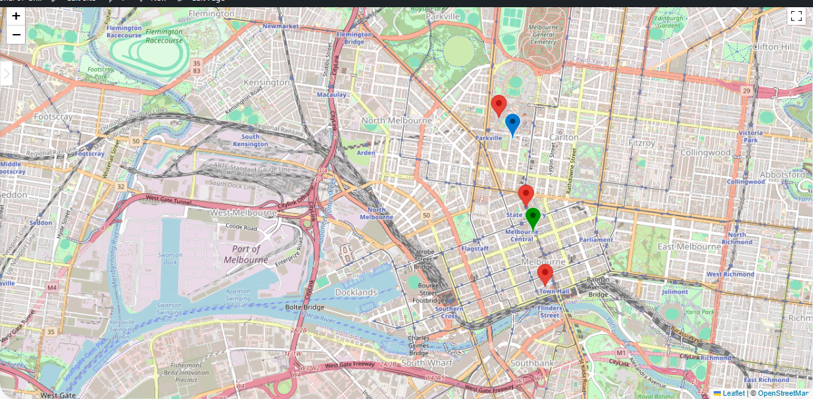
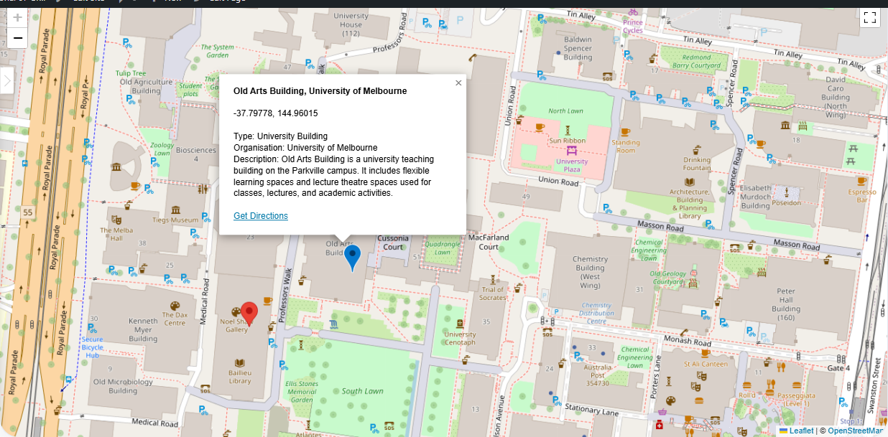
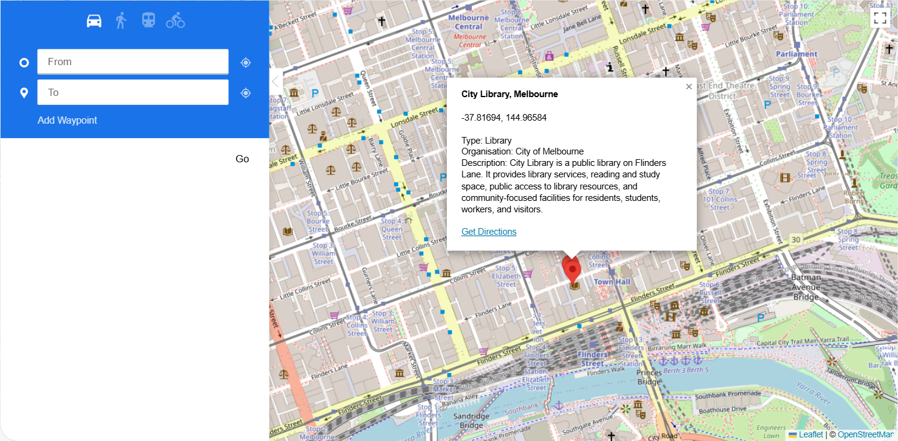
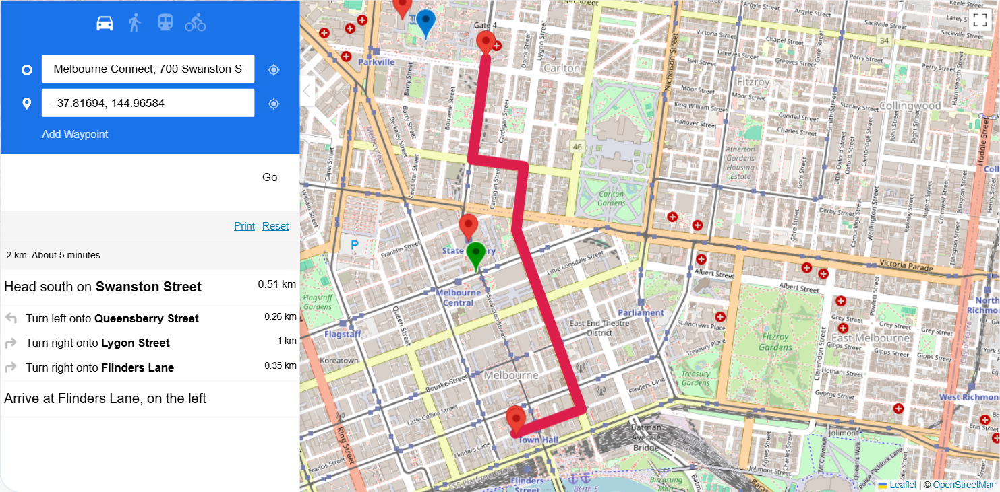

# Sprint Showcase - Assignment 2

- Document your Sprint Showcase for Assignment 2.
- Refer to Showcase_Example_and_Guide.md under the Guides folder for guidance on how to document this section. An example is shown.
- You can reuse formatting and sections from the guidance for documenting this section

------

## Sprint Goal

Deliver an interactive map showing selected University of Melbourne and RMIT University building locations and selected City of Melbourne area library locations, allowing users to view basic location details and obtain basic directions from a nominated starting point to a selected location.

## Completed Features

All four user stories committed in Sprint 1 were completed and validated against the Definition of Done.

| User Story ID | Feature | Status | Summary |
| ------------- | ------- | ------ | ------- |
| US-01 | Interactive map of selected university building locations (University of Melbourne and RMIT University) | Done | Old Arts Building (UoM) and RMIT Building 80 (Swanston Academic Building) are displayed as interactive markers on the live WordPress page. The map supports zoom, drag, and marker selection. The UoM building marker uses a blue icon and the RMIT building marker uses a green icon. |
| US-02 | Interactive map of selected library locations within the City of Melbourne area | Done | City Library (City of Melbourne) is displayed on the same map and opens a marker popup. Baillieu Library (UoM) and RMIT Swanston Library remain visible as optional contextual markers, but are not claimed as required `US-02` scope after the requirement clarification. |
| US-03 | Basic location details visible from a marker popup | Done | Clicking any marker displays the location name, coordinates, location type, organisation, and description. Selecting a different marker closes the current popup and updates the display to match the new location. |
| US-04 | Basic direction finding from a nominated starting point | Done | Users can click Get Directions from any marker popup. The destination is auto-populated from the selected marker. The user enters or confirms the starting point, such as Melbourne Connect or another entered location. Clicking Go draws the ORS route on the map in red. |

## Postponed Features

No user stories were de-prioritised or postponed during Sprint 1. All four committed stories were completed.

One implementation detail was accepted as a known environment constraint rather than a postponed feature:

| Item | Reason | Resolution |
| ---- | ------ | ---------- |
| Custom From/To input validation for US-04 | WordPress Code Snippets plugin returned 403 Forbidden; custom JavaScript validation could not be created under the current environment permissions. | Soft protection applied: Get Directions is only accessible after marker selection, and the destination field is auto-populated from the selected marker. The starting point is entered or confirmed by the user. |
| Practical close-detail zoom | The map supports zoom and pan, but final evidence review found that close inspection remains limited in dense CBD/campus areas. | Accepted as a Sprint 1 usability limitation and recorded as `DEF-005`; carry forward to Sprint 2 map usability checks. |
| Direction waypoint marker colours and category classification | When Get Directions is opened from a marker, WP Go Maps/OpenRouteService can create temporary default waypoint markers for the route start/end. A free-text direction input cannot be treated as a known building/library category unless it is matched to a stored marker/category record. | Accepted for Sprint 1 because the destination is selected from a known marker and the formal stored markers remain correct. Recorded as `DEF-006` for Sprint 2. Product-level repair should first check plugin waypoint-icon settings; if unsupported and permissions allow, use a custom client-side hook that matches route waypoints to stored marker/category records before applying category-specific icons. |

## Demo Summary

The Sprint 1 demonstration is framed as a realistic planning scenario: an outreach planner starts from Melbourne Connect, checks selected university buildings and a City of Melbourne library on the interactive map, opens marker details to confirm the destination, and then requests basic directions to the selected location.

The demonstration follows the path below on the live WordPress page (**Interactive Campus Map**), exercising all four user stories in sequence.

### Step 1 - Open the Interactive Campus Map page

The page loads with a map-first layout. The page title, feature summary, and map are visible. The map renders through WP Go Maps using Leaflet and OpenStreetMap tiles.

### Step 2 - Verify university building and library markers (US-01, US-02)

The following five markers are visible on the map:

| Marker | Type | Organisation | Sprint 1 Role |
| ------ | ---- | ------------ | ------------- |
| Old Arts Building | University Building | University of Melbourne | Required for US-01 |
| RMIT Building 80 (Swanston Academic Building) | University Building | RMIT University | Required for US-01 |
| City Library, Melbourne | Library | City of Melbourne | Required for US-02 |
| Baillieu Library | Library | University of Melbourne | Optional contextual marker |
| RMIT Swanston Library | Library | RMIT University | Optional contextual marker |

The map supports zoom and drag. The required building institutions (University of Melbourne and RMIT University) and the required City of Melbourne library area are represented. Markers remain visible and selectable when the user pans or zooms within the map view. The University of Melbourne and RMIT University building markers are distinguishable by colour: Old Arts uses a blue marker and RMIT Building 80 uses a green marker. Library marker colour distinction is not treated as a required Sprint 1 condition because the updated requirement states that it is no longer required.

The refreshed overview screenshot is therefore used to evidence the required UoM/RMIT building colour distinction only. Any red/default library markers visible in the screenshot do not contradict the Sprint 1 acceptance criteria, because library colour distinction was removed from the required `US-02` scope.

For US-02 evidence, the required library scope is deliberately bounded to City of Melbourne area library records. The data rule for the required library evidence is that the uploaded dataset should be reduced to the latest available year and to records that represent libraries only. Baillieu Library and RMIT Swanston Library may remain as contextual markers, but they are not used to satisfy the updated US-02 acceptance criterion.

### Step 3 - Click a marker to view basic location details (US-03)

Click any marker. The popup displays:

- Name
- Coordinates
- Location type
- Organisation
- Description

Clicking a different marker closes the current popup and displays the details for the newly selected location.

### Step 4 - Use Get Directions from a marker popup (US-04)

From any marker popup, click **Get Directions**. The destination field is automatically populated from the selected marker. The starting point is entered or confirmed in the From field, for example Melbourne Connect. Click **Go**. OpenRouteService calculates the route and draws it on the map in red.

The evidence image is stored as `Sprint_1/etc/S1_Directions_Route.png`. The route start/end waypoint markers use the plugin's default direction styling and may appear as temporary default markers after Get Directions is opened from a coloured building marker. These route-generated waypoints are separate from the stored location markers, so their default colour does not remove or weaken the separate `US-01` requirement that the UoM and RMIT building markers are colour-distinguishable. Sprint 1 therefore treats category validation as marker-selected destination behaviour only, not as classification of arbitrary free-text route input. The planned product-level repair is to check plugin waypoint-icon settings first, then, only if needed and permitted, add a client-side waypoint-matching rule against stored marker/category records.

### Step 5 - Confirm controlled failure behaviour (US-04)

The Get Directions workflow is accessible only after a marker has been selected, preventing the user from triggering routing without a valid destination. If routing data cannot be returned, the plugin presents a visible failure state rather than displaying misleading guidance.

## Asynchronous Demo Evidence

The repository evidence for the asynchronous showcase consists of the demo sequence above, the linked screenshots, and the QA table in `S1_Quality_Assurance.md`. Sprint 1 notes refer to screenshots/descriptions/videos as appropriate for the asynchronous demo; no separate mandatory Sprint 1 video requirement has been identified in the local requirement notes. If the assessment channel or tutor explicitly requests a video demonstration for Sprint 1, the team should record a short run-through of the same five-step path after the final team commit and release tag are agreed, so the video matches the submitted Git baseline.

## Learning Summary

Sprint 1 showed that the team needs to validate WordPress plugin permissions and third-party API settings before committing to custom behaviour. It also showed that requirement clarifications should be recorded as sprint events, not silently rewritten, and that a story should only be marked Done after WordPress behaviour, QA evidence, and linked Scrum artefacts agree with each other.

## Stakeholder Feedback and Action Items

The Sprint 1 showcase has been prepared for the designated assessment channel. Formal teaching-staff feedback will be received asynchronously after the Sprint 1 submission deadline.

| Feedback / Observation | Action |
| ---------------------- | ------ |
| US-04 custom validation could not be implemented because Code Snippets returned 403 Forbidden. | Carry the WordPress permission constraint into Sprint 2 planning and avoid assuming custom code support without early validation. |
| Final live-site review showed that the destination, not the From field, is auto-populated by marker selection. | Update Product Backlog, Sprint Backlog, Defect Log, Decision Log, and Showcase wording so the artefacts match observed behaviour. |
| Final QA found that the two university building markers initially used the same default red icon. | Update WP Go Maps marker icons so Old Arts uses blue and RMIT Building 80 uses green; record and close `DEF-004`; refresh showcase screenshots. |
| Direction route screenshot was required to evidence US-04 completion. | Store route screenshot in `Sprint_1/etc/S1_Directions_Route.png` and link it from this showcase. |
| Updated Sprint 1 requirement narrowed the required library scope to City of Melbourne area and removed university/public library colour distinction. | Update backlog, planning, QA, showcase, burn-down, and risk records so university library markers are treated as optional context rather than required acceptance evidence. |
| Final evidence review found limited close-detail zoom and default route waypoint colours. | Record `DEF-005` and `DEF-006`; carry both into Sprint 2 usability/category-validation planning. |
| Pre-submission review identified scoring risks around dataset traceability, live page accessibility, release tag timing, and conditional video expectations. | Keep dataset-scope wording explicit, retain screenshots as repository evidence, re-check the live WordPress page before tagging, and create the release tag only after team approval. Record a video only if Sprint 1 submission instructions explicitly request it. |

## Showcase Conclusion

Sprint 1 delivered the published baseline outcome: selected university building locations and the required City of Melbourne area library location are visible on an interactive map, marker details are available, and a basic route can be generated from a nominated starting point to a selected location. Remaining concerns relate to platform constraints and should be reviewed before Sprint 2 stories depend on custom WordPress behaviour.
