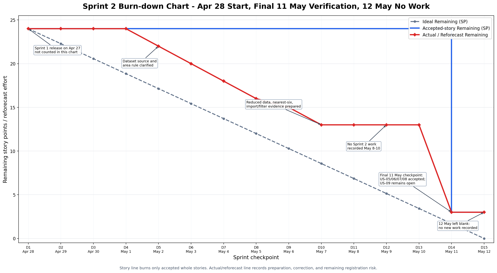

# Burn Down Chart - Assignment 2

- Document your Burn Down Chart to track the progress of Sprint 2 for Assignment 2.
- Refer to Burn_Down_Chart_Example_and_Guide.md under the Guides folder for guidance on how to document this section. An example is shown.
- You can reuse formatting and sections from the guidance for documenting this section.

------

## Sprint 2 Burn Down Chart

**Sprint Duration:** 28 April 2026 - 12 May 2026
**Tracking Basis:** Calendar checkpoints from the first Sprint 2 post-submission planning day through the 11 May final component verification checkpoint. The Sprint 1 release/submission on 27 April 2026 is treated as the prior baseline only and is not counted as a Sprint 2 burn-down day. The 12 May row is left as no work content recorded unless new work is added later.
**Total Story Points Committed:** 24 SP
**Stories:** US-05 (8 SP), US-06 (5 SP), US-07 (5 SP), US-08 (3 SP), US-09 (3 SP)

## Reconstruction and Update Rule

Sprint 2 uses the same burn-down structure as the formal Sprint 1 repository baseline, updated for the Sprint 1 assessment comments:

- Story points are assigned to user stories only, not to individual tasks.
- The story remaining line changes only at whole-story checkpoints, not for partial task progress.
- The ideal line stays fixed from the start of the sprint window to the final checkpoint.
- The actual/reforecast line records changes in expected remaining effort caused by implementation clarity, risk reduction, or unresolved blockers.
- The 11 May live-site QA table is a verification and reconciliation checkpoint. Earlier on 11 May it accepts US-08 after live authentication checks and records that US-05 to US-07 still need live school-map verification.
- The final 11 May checkpoint records the follow-up component-based school map update: the live page verifies US-05, US-06, and US-07 as whole stories. US-09 remains open because role-specific registration is not available.
- The 12 May checkpoint is intentionally blank for now: no Sprint 2 work content is recorded for that date unless new work is completed later.

This chart therefore does not burn half story points as partial credit, and it does not treat the rejected full-page prototype as accepted story delivery. Work still progresses from 1 May to 7 May through data reduction, nearest-six evidence, import-file generation, and QA preparation, but story points burn only when the live component behaviour is accepted.

## Sprint 1 Comparison Decision

The Sprint 1 burn-down line is **not** overlaid on the Sprint 2 chart. Sprint 1 and Sprint 2 have different commitments, story-point totals, and acceptance scopes, so putting both curves on one chart could make the Sprint 2 chart look like a cross-sprint performance comparison instead of a burn-down for the current sprint commitment.

Sprint 1 is still used as the Sprint 2 baseline in three ways:

- The Sprint 1 release/submission on **27 April 2026** identifies the prior repository baseline, but the Sprint 2 chart starts on **28 April 2026**.
- Sprint 2 reconstruction rules reuse the Sprint 1 assessment feedback: whole-story burn-down only, no task-level story points, and visible rework.
- The Sprint 1 burn-down remains in `Sprint_1/S1_Burn_Down_Chart.md` as historical evidence, while this chart focuses on US-05 to US-09 only.

## Risk Response Use of the Actual / Reforecast Line

The **Actual / Reforecast Remaining** line is retained from the Sprint 1 burn-down approach. It is not the accepted story-point line. It shows whether the team expected more or less remaining work after data feasibility, component readiness, live-site checks, or authentication limits became clearer.

This was useful in Sprint 2 because:

- `R002` was controlled once the official school dataset was reduced to 913 open records in the five required Melbourne areas.
- `R010` was reduced at data-preparation level by creating marker import and filter model files, and later controlled by the generated map widget that avoids displaying all 913 records at once.
- `R011` remained active because login redirect was verified but role-specific registration was not available.
- `R012` materialised when the live page initially still showed Sprint 1 content. It is now controlled for US-05 to US-07 because the current page uses an editable Gutenberg shell plus a controlled Sprint 2 school-map widget; the remaining open work is the US-09 registration limitation.

## Burn Down Data Table

| Day | Date | Ideal Remaining (SP) | Story Remaining (SP) | Actual / Reforecast Remaining (SP) | Daily Update / Change Note |
| --- | ---- | -------------------- | -------------------- | ---------------------------------- | -------------------------- |
| 1 | Apr 28 | 24.0 | 24 | 24 | Sprint 2 starts after the 27 April Sprint 1 release/submission baseline; Sprint 1 comments and Sprint 2 requirement changes are reviewed. |
| 2 | Apr 29 | 22.3 | 24 | 24 | Sprint 2 requirement areas are mapped to US-05 to US-09; no story reaches a completion checkpoint. |
| 3 | Apr 30 | 20.6 | 24 | 24 | WordPress page baseline, formal Sprint 1 artefacts, and Sprint 2 data needs are reviewed; no story reaches a completion checkpoint. |
| 4 | May 1 | 18.9 | 24 | 24 | Sprint 2 scope confirmed; map/search/filter/login/registration stories are split and estimated. |
| 5 | May 2 | 17.1 | 24 | 22 | Dataset source and five required Melbourne areas are reviewed. Reforecast drops because the official CSV path and reduction rule are clear, but no whole story is burned yet. |
| 6 | May 3 | 15.4 | 24 | 20 | Reduced school dataset and map-ready fields are prepared with 913 open records. No whole story is accepted until live component verification passes. |
| 7 | May 4 | 13.7 | 24 | 18 | Nearest-six secondary-school analysis and website/logo evidence reduce expected remaining work for US-07, but US-07 is not accepted. |
| 8 | May 5 | 12.0 | 24 | 16 | Search input handling, coordinate support, and nearby-results design are prepared for the component path, but US-06 is not accepted. |
| 9 | May 6 | 10.3 | 24 | 15 | Authentication QA cases and WordPress component rollback checks are prepared. |
| 10 | May 7 | 8.6 | 24 | 13 | Marker import file, filter model, generated widget plan, and live-update checklist are prepared. US-05 to US-07 still require live component verification. |
| 11 | May 8 | 6.9 | 24 | 13 | No Sprint 2 work content recorded. |
| 12 | May 9 | 5.1 | 24 | 13 | No Sprint 2 work content recorded. |
| 13 | May 10 | 3.4 | 24 | 13 | No Sprint 2 work content recorded. |
| 14 | May 11 | 1.7 | 3 | 3 | **Final 11 May completed checkpoint:** live-site QA confirms login redirect, username/password fields, invalid-login error behaviour, reduced school map, default Melbourne Connect focus, 1 km distance, kilometre units, controlled marker visibility, location/coordinate search, nearby results, no-match handling, category-filter combinations, nearest-six filtering, sector colours, all six nearest-school popup logo/website checks, and wide-screen page-shell centring. US-09 remains open. |
| 15 | May 12 | 0.0 | 3 | 3 | No Sprint 2 work content recorded for 12 May. Remaining accepted-story SP stays unchanged until new work is completed. |

## Burn Down Chart Visual

The chart image is included as a reviewer-facing evidence file. The data table above is the authoritative source for the chart values; non-submission chart-generation tooling is not included in `Sprint_2/etc/`.

The chart above plots three signals:

- The **Ideal Burn Down Line** runs straight from 24 SP on 28 April 2026 to 0 SP on 12 May 2026.
- The **Story Remaining Line** shows accepted whole-story checkpoints only.
- The **Actual / Reforecast Remaining Line** shows realistic remaining effort after data feasibility, implementation progress, component-architecture correction, and unresolved registration limits became clearer.
- The chart annotations mark only major interpretation points: data-source clarity, prepared data/filter evidence, the 11 May component correction, the 11 May US-05/US-06/US-07 acceptance checkpoint, and the 12 May no-work checkpoint. They are explanatory labels, not extra task-level burn-down events.

## Chart Interpretation

**X-Axis:** Sprint checkpoints from 28 April 2026 to 12 May 2026. The Sprint 1 release/submission on 27 April is a prior baseline reference only, not a plotted Sprint 2 day.

**Y-Axis:** Remaining story points / reforecast effort from the 24 SP Sprint 2 commitment.

**Ideal Burn Down Line:** The ideal line decreases linearly across the full chart window. It is not changed when task progress, non-working dates, or unresolved registration issues occur.

**Story Remaining Line:** This line uses whole-story checkpoints only. It remains at 24 SP until the final 11 May checkpoint because earlier work prepared data, scripts, imports, and QA evidence without meeting the live-site DoD for a whole story:

- May 3 to May 7: dataset, nearest-six evidence, marker import, filter model, and verification plans progress, but no live component story is accepted yet.
- May 8 to May 10: no Sprint 2 work content is recorded, so the line remains at 24 SP.
- May 11: US-08, US-05, US-06, and US-07 reach live acceptance by the final checkpoint, reducing remaining work to 3 SP.
- May 12: no Sprint 2 work content is recorded, so the line remains at 3 SP.

**Actual / Reforecast Remaining Line:** This line gives the team a process signal. It drops from 24 SP to 22 SP on May 2 when the data source and reduction rule become clear, then falls progressively as import data, nearest-six evidence, and component-readiness work are prepared. It remains flat from May 8 to May 10 because no work content is recorded. On May 11 the rejected full-page prototype and component-baseline correction are recorded, then final live verification reduces the remaining forecast to 3 SP because US-05, US-06, US-07, and US-08 pass live acceptance while US-09 remains visible as open work. On May 12 it stays flat at 3 SP because no new work is recorded.

**Key Observation:** Sprint 2 progress is shown as staged preparation from 1 May to 7 May, followed by corrective verification, component-based school-map verification, and wide-screen page-shell centring on 11 May. The remaining 3 accepted-story SP belong to US-09 only. Login redirect, reduced school map loading, Melbourne Connect default behaviour, location/coordinate search, nearby results, no-match handling, category-filter combinations, nearest-six filtering, sector-coloured markers, all six nearest-school logo/website popups, and wide layout are verified; role registration remains open. No Sprint 2 work is recorded for 12 May at this checkpoint.
