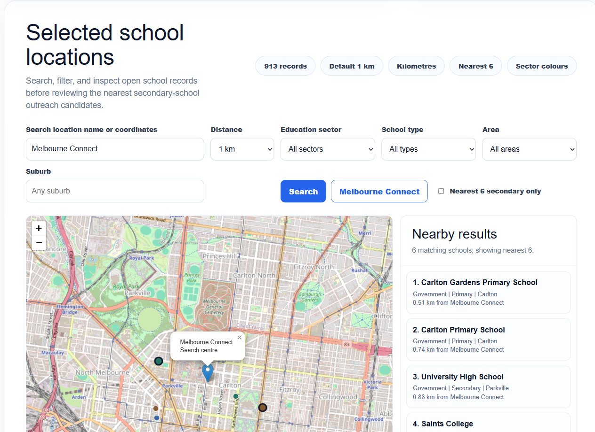
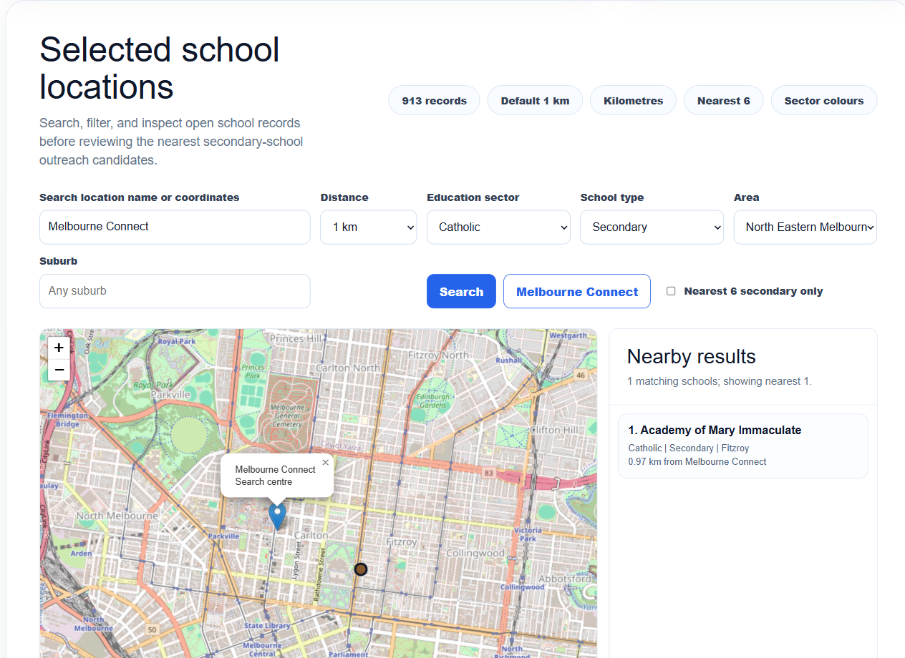
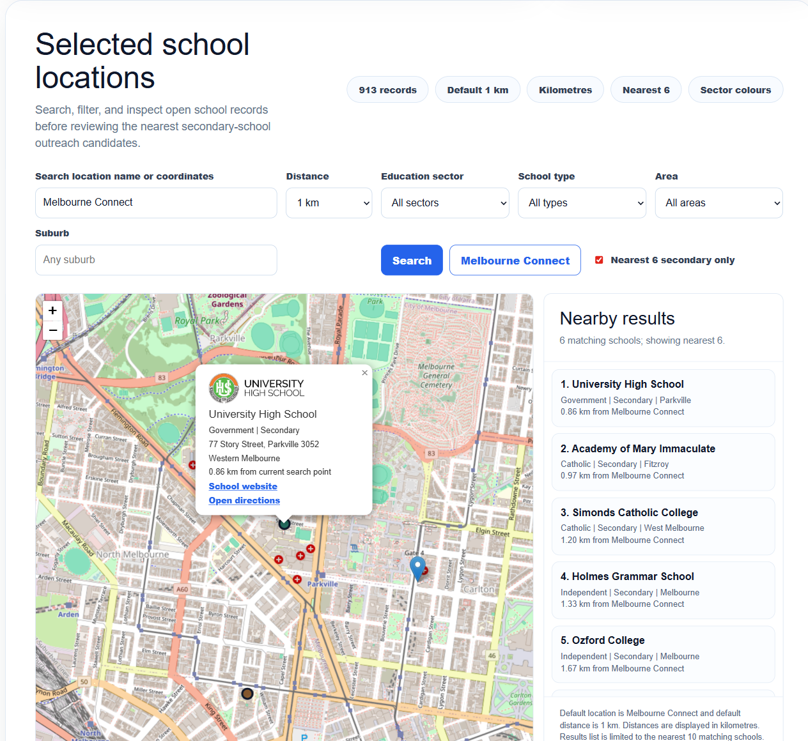

# Sprint Showcase - Assignment 2

- Document your Sprint Showcase for Assignment 2.
- Refer to Showcase_Example_and_Guide.md under the Guides folder for guidance on how to document this section. An example is shown.
- You can reuse formatting and sections from the guidance for documenting this section.

------

## Sprint 2 Showcase Overview

| Category | Details |
| -------- | ------- |
| Sprint Goal | Deliver school-location map/search/filter functionality and authenticated site access for Sprint 2 while preserving the Sprint 1 map foundation. |
| Showcase Status | Component-based live school-map checkpoint as of 11 May 2026. |
| Evidence Principle | Only verified behaviour is listed as complete. US-05, US-06, and US-07 are accepted; US-09 remains visible because role-specific registration is still incomplete. |

## Completed / Verified Items

| Item | Evidence | Status |
| ---- | -------- | ------ |
| Reduced Sprint 2 school dataset | `Sprint_2/etc/S2_Reduced_School_Locations_2025.csv` contains 913 open school records in the required five Melbourne areas. | Verified |
| Repeatable data generation | `Sprint_2/etc/generate_sprint2_school_outputs.py` regenerates the reduced CSV, nearest-six CSV, WP Go Maps marker import CSV, filter model CSV, and data evidence notes. | Verified |
| Separate Sprint 2 evidence path | `Sprint_2/etc/` contains reviewer-facing verification notes, reduced data, marker import evidence, filter model evidence, chart output, and the CSV-generation helper script without overwriting the Sprint 1 campus/library baseline. | Verified |
| WordPress component restoration | The home page was restored to an editable Gutenberg shell and the clickable header is visible again. | Verified |
| Sprint 2 page component update | The live home page uses Gutenberg blocks for the editable shell plus one controlled school-map widget rather than a single full-page prototype. | Verified |
| Architecture rationale | The hero remains Gutenberg block markup with CSS for visual precision; the map uses a controlled HTML widget as a risk response to the Sprint 1 component limits recorded in `DEF-003`, `DEF-005`, and `DEF-006`. Without this bounded widget, the larger Sprint 2 map could repeat the earlier limits around plugin configuration, close-detail usability, category handling, and default route/marker behaviour while also needing coordinate search, nearest results, sector colours, and 913-record density control. | Verified |
| Baseline-protection evidence | Component restore and live-site verification notes record that the Sprint 1 campus/library baseline was protected before Sprint 2 school-map work continued. | Verified |
| Wide-screen layout centring | The live page shell is centred within the wide viewport so the Sprint 2 map and evidence card do not sit against the far left with excessive blank space on the right. | Verified |
| Live school markers | The live page displays filtered school markers from the reduced dataset instead of showing all 913 records at once. | Verified |
| Melbourne Connect default and search | First load uses Melbourne Connect, 1 km, and kilometre units; searching Melbourne Connect keeps the map around nearby schools. | Verified |
| Coordinate search | `-37.8001,144.9643` updates the focus and recalculates nearby results. | Verified |
| Nearby results list | The right-side panel lists up to 10 nearby schools with name, sector, type, suburb, and distance. | Verified |
| No-match search state | `not-a-real-place-90016` displays a clear no-match status and guidance message. | Verified |
| Category filters | One-, two-, and three-category combinations were live-tested across suburb, sector, type, area, and nearest-six cases. | Verified |
| Sector marker colours | Markers use sector-based colours with stronger styling for nearest-six schools. | Verified |
| Nearby secondary school popup | All six nearest-secondary popups show logo images, school fields, website links, and directions links. | Verified |
| Login redirect for unauthenticated users | Public request to the site redirects to `wp-login.php`. | Verified |
| Invalid-login error | A clearly invalid username test returned a WordPress login error. | Verified |

## Screenshot Evidence

The screenshots below support the asynchronous showcase. They are not a replacement for the live site; they provide reviewer-facing evidence for the main demo paths.

| Screenshot | Demonstrated Behaviour |
| ---------- | ---------------------- |
|  | Melbourne Connect default search, 1 km distance, kilometre units, controlled marker visibility, and nearby school list. |
|  | Combined sector, type, and area filters with matching map/list results. |
|  | Nearest-six secondary-school filter, popup logo, website link, and directions link. |

## Prepared School Data for Demo

| School | Sector | Type | Area | Distance from Melbourne Connect | Website |
| ------ | ------ | ---- | ---- | ------------------------------- | ------- |
| University High School | Government | Secondary | Western Melbourne | 0.86 km | https://unihigh.vic.edu.au/ |
| Academy of Mary Immaculate | Catholic | Secondary | North Eastern Melbourne | 0.97 km | https://www.academy.vic.edu.au/ |
| Simonds Catholic College | Catholic | Secondary | Western Melbourne | 1.20 km | https://www.sccmelb.catholic.edu.au/ |
| Holmes Grammar School | Independent | Secondary | Western Melbourne | 1.33 km | https://www.holmesgrammar.vic.edu.au/ |
| Ozford College | Independent | Secondary | Western Melbourne | 1.67 km | https://ozford.edu.au/ |
| Princes Hill Secondary College | Government | Secondary | North Eastern Melbourne | 1.85 km | https://www.phsc.vic.edu.au/ |

## Open / Postponed Items

| Item | Current State | Follow-up Action |
| ---- | ------------- | ---------------- |
| Role-specific registration | Public registration redirects to the local signup page, but registration is disabled and outreach officer/student role options are not present. | Confirm whether registration can be enabled safely and whether role selection can be added through an approved plugin or site setting. |

## Demo Summary

The 11 May checkpoint can demonstrate a real Sprint 2 increment while keeping incomplete acceptance criteria visible:

1. Open the site as an authenticated user and confirm the clickable site header remains visible.
2. Confirm the page is built from Gutenberg blocks plus one controlled school-map widget, not from one large full-page prototype.
3. Show the Sprint 2 hero and map section with the same rounded-card visual language as the Sprint 1 page.
4. Confirm the page shell is centred on a wide screen and keeps the editable WordPress header and Gutenberg shell.
5. Confirm the default school map uses Melbourne Connect, 1 km, and kilometre units.
6. Show that default marker visibility is controlled: 6 nearby schools appear, not all 913 records.
7. Search by coordinates and show the nearby list recalculates.
8. Apply one-, two-, and three-category filter combinations and show the result count changes.
9. Select nearest-six secondary schools and show the prepared six-school result set.
10. Open nearest-secondary popups and show logo, address, sector, type, area, suburb, distance, website, and directions links.
11. Review the reduced dataset file and confirm it contains 913 open school records.
12. Review the six nearest secondary school evidence file.
13. Review the generated marker import CSV, filter model CSV, and CSV-generation helper script.
14. Verify unauthenticated access redirects to login and invalid credentials display an error.

US-05, US-06, and US-07 can be demonstrated as accepted at the 11 May checkpoint. US-09 should not be demonstrated as complete because registration is disabled.

## Stakeholder Feedback and Action Items

| Feedback / Observation | Action Item | Owner | Status |
| ---------------------- | ----------- | ----- | ------ |
| Sprint 1 feedback warned against partial story-point burn-down. | Sprint 2 burn-down uses accepted-story remaining SP only. | @Manting Yu | Completed |
| Sprint 1 feedback warned against task-level story point distribution. | Sprint 2 backlog keeps story points in the story-status summary and removes story-point values from the task tracking table. | @Fazheng Xu | Completed |
| Sprint 1 feedback asked for action-item follow-up in stand-up records. | Sprint 2 stand-up log includes previous-work/follow-up and action status. | @Manting Yu | Completed |
| Full-page prototype removed the WordPress component-editing trail. | Restore the page to a Gutenberg shell with one controlled school-map widget and keep the generated full prototype as historical evidence only. | @Jiajun Jiang and @Fazheng Xu | Completed |
| Sprint 2 school markers should not overwrite the Sprint 1 map baseline. | Keep Sprint 2 generated data/page evidence separate from the Sprint 1 campus/library baseline. | @Fazheng Xu and @Conghao Lin | Completed |
| Sprint 1 component limitations need a clear Sprint 2 resolution path. | Record that the controlled school-map widget is a bounded component compromise for the larger searchable/filterable school dataset, while the hero and page shell remain editable Gutenberg blocks. | @Fazheng Xu | Completed |
| Location-name search, coordinate search, default 1 km behaviour, nearby results, category filters, and nearest-secondary popup checks now pass. | Accept US-05, US-06, and US-07; keep US-09 open for role-specific registration. | @Fazheng Xu and @Conghao Lin | Completed |
| Wide-screen review found excessive blank space to the right of the Sprint 2 content. | Centre the existing Gutenberg shell with a targeted CSS rule and verify that the map component remains unchanged. | @Fazheng Xu and @Jiajun Jiang | Completed |
| Role-specific registration remains unavailable. | Keep US-09 open and track as `DEF-008`. | @Zihan Shi and @Fazheng Xu | Open |
